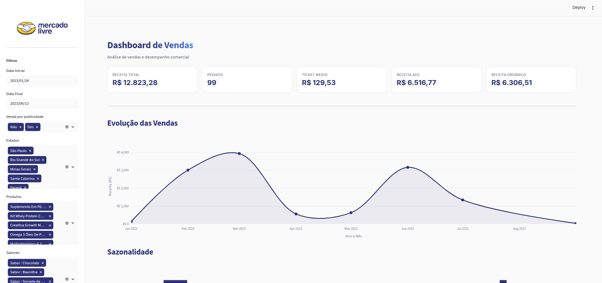
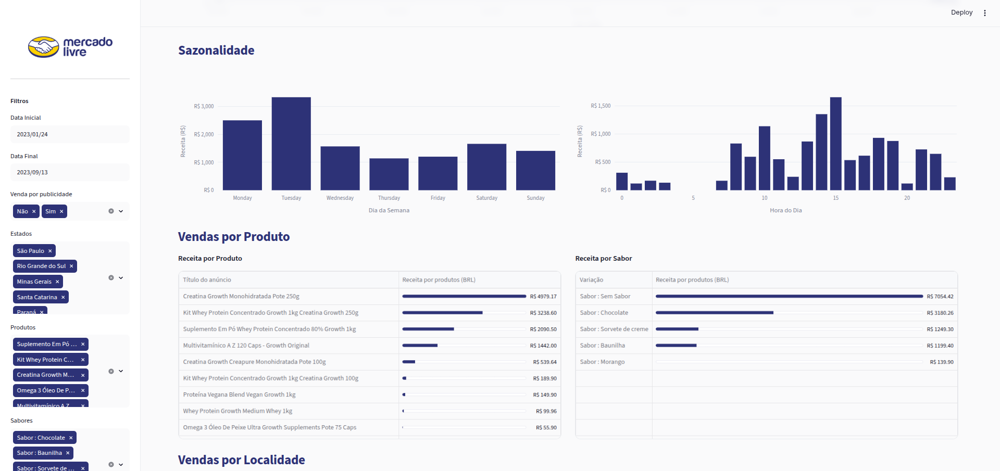
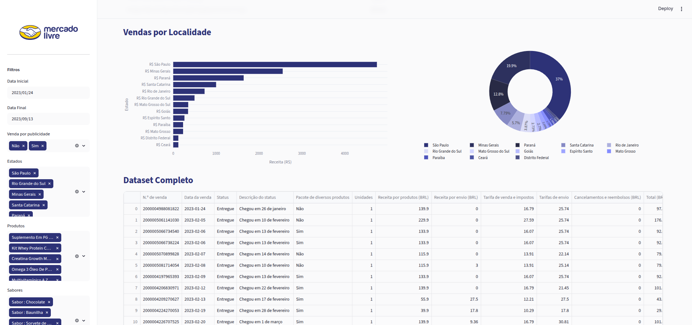

# Dashboard de Vendas - Mercado Livre

Dashboard interativo desenvolvido em Streamlit para análise de dados de vendas
do Mercado Livre. Fornece visualizações de receita, desempenho por produto,
sazonalidade e análise geográfica de vendas.

## Preview

<div align="center">
  
  <p><em>Visão geral do dashboard com KPIs e evolução de vendas.</em></p>
</div>

<br>

<div align="center">
  
  <p><em>Análise de sazonalidade e ranking de produtos e sabores.</em></p>
</div>

<br>

<div align="center">
  
  <p><em>Análise geográfica de vendas e visualização completa do dataset.</em></p>
</div>

## Funcionalidades

- Métricas principais: Receita Total, Pedidos, Ticket Médio, Receita Ads e Receita Orgânica
- Evolução de vendas ao longo do tempo (gráfico de linha)
- Análise de sazonalidade por dia da semana e hora do dia
- Ranking de produtos e sabores por receita
- Análise geográfica de vendas por estado
- Filtros interativos: Data, Publicidade, Estado, Produto e Sabor
- Visualização completa do dataset

## Requisitos

- Python 3.8+
- Bibliotecas listadas em `requirements.txt`

## Instalação

```bash
pip install -r requirements.txt
```

## Como executar

1. Coloque o arquivo de dados (`vendas_mercado_livre_2023.csv`) na pasta `dados/`
2. Certifique-se de que o logo está em `imagens/mercado-livre-logo-8.png`
3. Execute:

```bash
streamlit run app.py
```

4. A aplicação será aberta no navegador em `http://localhost:8501`

## Estrutura do projeto

```
Vendas_Mercado_Livre/
├── app.py                          # Ponto de entrada da aplicação
├── requirements.txt
├── README.md
├── .gitignore
├── .streamlit/
│   └── config.toml                 # Tema da aplicação
├── dados/
│   └── vendas_mercado_livre_2023.csv
├── imagens/
│   ├── mercado-livre-logo-8.png
│   └── readme/                     # Imagens de preview do README
│       ├── ML_01.png
│       ├── ML_02.png
│       └── ML_03.png
└── dashboard_mercado_livre/        # Pacote com a lógica do dashboard
    ├── __init__.py
    ├── constantes.py               # Caminhos, chaves de colunas e parâmetros
    ├── etl.py                      # Pipeline ETL (carregamento dos dados)
    ├── estilo.py                   # CSS injetado e hero/header do dashboard
    ├── formatacao.py               # Locale e formatação de moeda
    ├── metricas.py                 # Métricas de negócio
    ├── agregacoes.py               # Agregações para gráficos
    ├── filtros.py                  # Aplicação dos filtros
    ├── graficos.py                 # Template Plotly e helpers visuais
    └── componentes.py              # Componentes visuais reutilizáveis
```

## Dados esperados

O arquivo CSV deve conter as seguintes colunas:

- Data da venda
- Data a caminho completa
- Data de entrega completa
- Unidades
- Reclamação encerrada
- N.º de venda
- Tarifa de venda e impostos
- Tarifas de envio
- Cancelamentos e reembolsos (BRL)
- Receita por produtos (BRL)
- Venda por publicidade
- Estado
- Título do anúncio
- Variação

## Desenvolvido por

Renato Perussi

Junho de 2026
