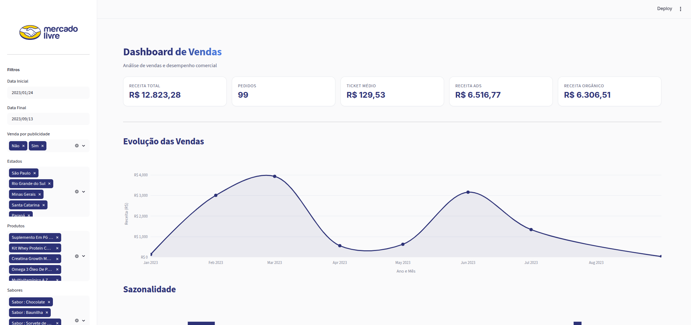
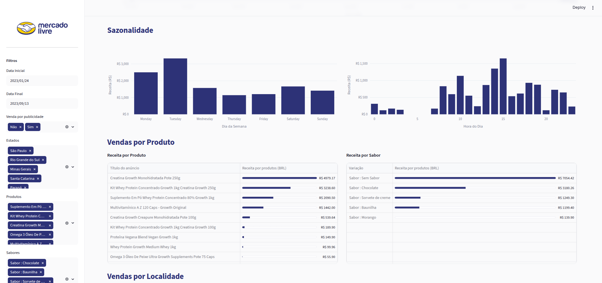
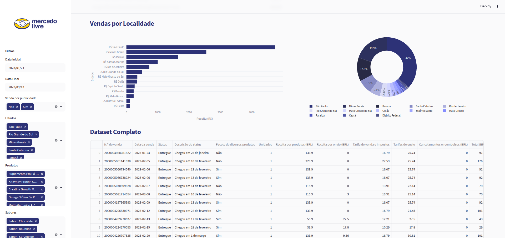

# Dashboard de Vendas — Mercado Livre


Dashboard interativo em Streamlit para análise de vendas do Mercado Livre: KPIs de receita, evolução temporal, sazonalidade, ranking de produtos e distribuição geográfica, com filtros na barra lateral.

## Capturas de Tela

<div align="center">
  
  <p><em>Visão geral com KPIs e evolução das vendas.</em></p>
</div>

<br>

<div align="center">
  
  <p><em>Sazonalidade e ranking de produtos.</em></p>
</div>

<br>

<div align="center">
  
  <p><em>Distribuição geográfica e visão completa dos dados.</em></p>
</div>

## Funcionalidades

- KPIs principais: receita total, pedidos, ticket médio, receita de anúncios e receita orgânica
- Evolução mensal das vendas (gráfico de linha suavizada)
- Sazonalidade por dia da semana e hora do dia
- Ranking de produtos e sabores com barras de progresso
- Análise geográfica por estado (barras + donut)
- Filtros interativos: período, canal de publicidade, estado, produto e sabor
- Tabela completa dos dados

## Tecnologias

- Python 3.12+
- Streamlit, Pandas, Plotly, NumPy, PyArrow, Pillow
- Pytest, Ruff, Coverage (desenvolvimento)

## Estrutura do Projeto

```text
.
├── app.py                    # Ponto de entrada do Streamlit (orquestração)
├── pyproject.toml            # Configuração do Ruff + Pytest + Coverage
├── requirements.txt          # Dependências de produção (mínimas, >=)
├── requirements-dev.txt      # Dependências de dev (pytest, ruff, coverage)
├── .streamlit/config.toml    # Tema da aplicação
├── data/sales_2023.csv       # Base de exemplo (pequena, versionada)
├── assets/logo.png           # Logo usado em tempo de execução
├── docs/screenshots/         # Imagens do README
├── sales_dashboard/          # Pacote da aplicação
│   ├── __init__.py
│   ├── constants.py          # Caminhos, chaves de colunas e parâmetros
│   ├── etl.py                # Carga, conversão de tipos e colunas temporais
│   ├── formatting.py         # Formatação de moeda
│   ├── metrics.py            # Métricas de negócio
│   ├── aggregations.py       # Agregações para os gráficos
│   ├── filters.py            # Lógica de filtros + FilterSelection
│   ├── charts.py             # Tema Plotly e layout
│   ├── styles.py             # Injeção de CSS e hero
│   └── components.py         # Componentes visuais do Streamlit
└── tests/                    # Suíte de testes Pytest
    ├── conftest.py
    ├── test_etl.py
    ├── test_metrics.py
    ├── test_aggregations.py
    ├── test_filters.py
    └── test_formatting.py
```

Camadas: `constants.py` (configuração), `etl.py` (carga de dados), `metrics.py` / `aggregations.py` / `filters.py` (regras de negócio), `charts.py` / `styles.py` / `components.py` (interface), `app.py` (apenas composição).

Os cabeçalhos do CSV original permanecem em português (dado de origem) e são referenciados por constantes em inglês. As colunas derivadas usam snake_case em inglês (`year_month`, `weekday`, `hour`, `transit_days`, ...). Identificadores, comentários e docstrings do código são 100% em inglês; os rótulos da interface permanecem em português para o usuário brasileiro.

## Instalação

```bash
python -m venv .venv
source .venv/bin/activate
pip install -r requirements.txt
```

Ambiente de desenvolvimento:

```bash
pip install -r requirements-dev.txt
```

## Como Usar

```bash
streamlit run app.py
```

Acesse `http://localhost:8501`. Os dados são carregados de `data/sales_2023.csv` via `DATA_PATH` em `sales_dashboard/constants.py`. Substitua esse arquivo para analisar outra exportação com o mesmo esquema.

## Configuração

- Tema: `.streamlit/config.toml` (cor principal `#2D3277`, base clara).
- Logo: `assets/logo.png` referenciado por `LOGO_PATH`.
- Tamanho dos rankings: `TOP_N` em `constants.py`.
- Lint: `pyproject.toml` (`line-length = 100`, aspas simples obrigatórias).

## Esquema dos Dados

Colunas esperadas no CSV:

- `Data da venda`, `Data a caminho completa`, `Data de entrega completa`
- `Unidades`, `Reclamação encerrada`, `N.º de venda`
- `Tarifa de venda e impostos`, `Tarifas de envio`, `Cancelamentos e reembolsos (BRL)`
- `Receita por produtos (BRL)`, `Venda por publicidade` (`Sim`/`Não`)
- `Estado`, `Título do anúncio`, `Variação`

O ETL converte datas, inteiros anuláveis e taxas absolutas, além de derivar `year_month`, `year`, `month`, `day`, `hour`, `minute`, `weekday`, `quarter`, `weekday_name`, `month_name`, mais os deltas de trânsito/entrega/total.

## Testes

```bash
pytest -v
coverage run -m pytest && coverage report
```

As fixtures estão em `tests/conftest.py` e usam `tmp_path` (sem caminhos absolutos).

## Lint

```bash
ruff check .
ruff format --check .
ruff format .  # correção automática quando necessário
```

A configuração exige aspas simples, ordenação isort e `line-length = 100`.

## Como Contribuir

- Use identificadores em inglês, aspas simples, type hints e docstrings.
- Mantenha módulos pequenos com responsabilidade única.
- Adicione cobertura Pytest para a regra de negócio antes de refatorar.
- Rode `pytest -v`, `ruff check .` e `ruff format --check .` antes de abrir um PR.

## Licença

MIT — veja [LICENSE](LICENSE).

## Autor

Renato Perussi — junho de 2026. Refatorado em outubro de 2026 para um layout modular pronto para produção.
